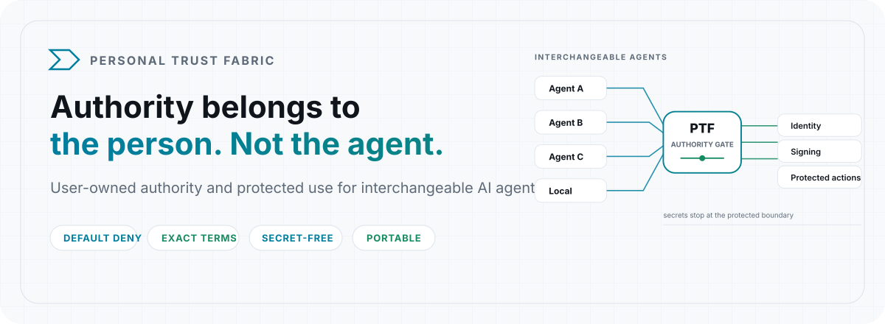
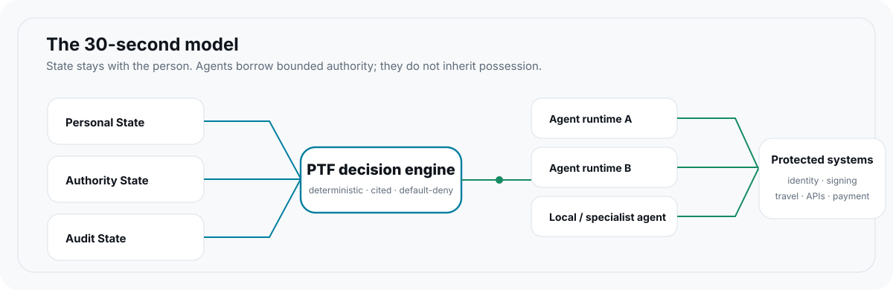
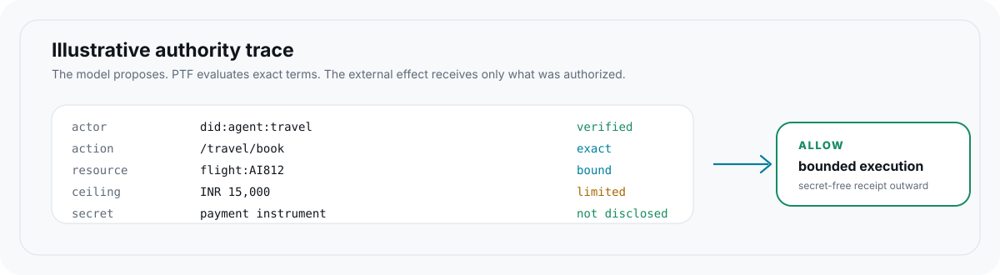

<!-- PTF-BRAND:START -->

<picture>
  <source media="(prefers-color-scheme: dark)" srcset="./assets/brand/hero-dark.svg">
  <source media="(prefers-color-scheme: light)" srcset="./assets/brand/hero-light.svg">
  
</picture>

PTF is a **user-owned authority and protected-use control plane for agentic systems**. Interchangeable agents can use precisely bounded pieces of a person's authority, data, and credentials without possessing the underlying secrets. Agents may reason about authority; they are never its source.

| Without a user-owned trust layer | PTF design principle |
| --- | --- |
| Agents receive broad credentials, tokens, or secrets | Authority is scoped to a bounded operation |
| Sensitive values enter model context or tool calls | Secrets remain behind the protected-use boundary |
| Permission is recreated inside each agent platform | Authority is modeled independently of the current agent runtime |
| Protocol messages can be mistaken for permission | External messages are evidence; deterministic authority decides |

<picture>
  <source media="(prefers-color-scheme: dark)" srcset="./assets/brand/architecture-dark.svg">
  <source media="(prefers-color-scheme: light)" srcset="./assets/brand/architecture-light.svg">
  
</picture>

**The invariants are the product:** default deny · Personal State ≠ Authority State · policy narrows but never creates authority · exact terms · use without possession · external messages are evidence, never authority.

<picture>
  <source media="(prefers-color-scheme: dark)" srcset="./assets/brand/authority-trace-dark.svg">
  <source media="(prefers-color-scheme: light)" srcset="./assets/brand/authority-trace-light.svg">
  
</picture>

> **Scope boundary:** PTF owns authority, policy, protected state, approval, secret mediation, execution authorization, portable semantics, and audit evidence. It does **not** own payment rails, settlement, wallets, merchant acquiring, identity issuance, or external provider systems. Payment is one optional domain profile.

<!-- PTF-BRAND:END -->

## Status

This is a working, tested reference implementation on the road to peer review — not a finished product. What CI proves on every merge: strict TypeScript, the full unit suite, attack/property evaluations, public-seam and zero-dependency hygiene, secret scanning. See `docs/audit/verify.md` to reproduce from scratch.

What it **is** today: a strong local authority engine, an encrypted personal-state vault, a propose→present/redeem→receipt agent loop for disclosure and payment (general actions propose-only), a domain-neutral provider seam with payment as one profile, and hash-chained audit — all tested including abuse cases. PTF will not become a PSP, wallet, settlement service, or rail.

What it **is not** yet: a live execution platform (reference providers move nothing), a multi-user service (single-operator topology), an HSM-backed custodian (file keystore reference), or a published package (npm pending). Every ceiling is documented in `docs/audit/limits.md` — the file lists what PTF _cannot_ do more carefully than what it can. Unresolved items are tracked as milestones below, not buried.

## For humans: run it in 60 seconds

Requires Node 22+.

```sh
npm install
npm run typecheck && npm test && npm run eval
```

Decide locally in three steps — grant authority, build the operation, evaluate:

```ts
import { Authority, paymentBounds } from "personal-trust-fabric";
import { recipientBounds } from "personal-trust-fabric/profiles/payment";

const authority = new Authority();
authority.addGrant({
  id: "groceries",
  principal: "did:example:you",
  actor: { kind: "exact", id: "did:example:agent" },
  action: { name: "/pay" },
  bounds: [
    ...paymentBounds({ amountMax: 2000, currency: "INR" }),
    ...recipientBounds(["did:example:shop"]),
  ],
});

const decision = authority.evaluate(
  {
    action: { name: "/pay" },
    resource: { type: "invoice", id: "invoice:inv-1" },
    context: { amount: 1790, currency: "INR", recipient: "did:example:shop" },
    purpose: "groceries",
  },
  {
    id: "did:example:agent", // verified OUT-OF-BAND by the host — never from the request body
    principal: "did:example:you",
    source: "local-registration",
    proofRef: "example",
  }
);
if (!decision.allow) throw new Error("denied");
// Every allow cites its grant: decision.citations[0].authorityId === "groceries"
```

## Operator quickstart (real use)

```sh
export PTF_PASSPHRASE_FILE="$HOME/.ptf/passphrase" && chmod 600 "$HOME/.ptf/passphrase"
node dist/src/cli.js --dir ./ptf-store init
node dist/src/cli.js --dir ./ptf-store keygen --alias you
node dist/src/cli.js --dir ./ptf-store keygen --alias shop
node dist/src/cli.js --dir ./ptf-store recipient --alias shop --key <hex-from-keygen>
node dist/src/cli.js --dir ./ptf-store grant --id g1 --principal you --cmd /pay --agent shopper --amount-max 2000 --currency INR --recipient shop
node dist/src/cli.js --dir ./ptf-store pay --principal you --agent shopper --recipient shop --amount 100 --currency INR --resource invoice:1 --yes
node dist/src/cli.js --dir ./ptf-store audit --verify
node dist/src/cli.js --dir ./ptf-store backup --to ./backups/ptf-store
node dist/src/cli.js --dir ./ptf-restored restore --from ./backups/ptf-store
node dist/src/cli.js --help
```

One CLI/MCP writer per store (optimistic revision control fails closed instead of last-write-wins). Vault records persist AES-256-GCM-encrypted under a keystore DEK with freshness binding; proposals persist per termsDigest file (restart-safe, idempotent); backups are one unit plus an anchor checkpoint and refuse to merge vintages. See `docs/audit/operations.md` for the container image, health signals, rotation, and restore drills.

## For agents and agent builders: the MCP contract

The server speaks for ONE fixed identity pinned at startup — tool schemas carry no identity fields, so callers can never self-certify.

```json
{
  "mcpServers": {
    "personal-trust-fabric": {
      "command": "node",
      "args": ["./dist/src/mcp-server.js"],
      "cwd": "/path/to/personal-trust-fabric",
      "env": {
        "PTF_STORE_DIR": "./ptf-store",
        "PTF_PASSPHRASE": "via-file-or-env",
        "PTF_MCP_PRINCIPAL": "did:example:you",
        "PTF_MCP_ACTOR": "did:example:agent"
      }
    }
  }
}
```

Tools: `ptf_propose` (dry-run, exact terms + digest), `ptf_check` (status), `ptf_redeem` (`/pay` challenge→proof→receipt), `ptf_request_data` (propose a disclosure) → `ptf_present_data` (holder-signed presentation, nonce-bound, single-present), `ptf_request_action` (propose any `/-path` except `/disclose*`), `ptf_get_receipt`, `ptf_list_capabilities` (this identity's live grants only), `ptf_revoke` (request-only). There is deliberately **no approve tool**: humans approve in the CLI, or standing grants cover the demand. The server only ever spends what already exists. See `examples/mcp-client-config.json` and `examples/vault-protected-action.mjs` for the full loop.

## How it works (four planes)

- **Personal State plane** (`src/store/vault.ts`) — encrypted, purpose/agent/expiry/sensitivity-scoped records. No generic read exists: every access is a constrained, audited request.
- **Authority plane** (`src/core/`) — zero-dependency, deterministic: standing grants + digest-bound one-time approvals, narrowed-only by policy, attenuated capabilities (`child ≤ parent`), recipient authentication before execution.
- **Protected execution plane** (`src/core/execute.ts`, `src/adapters/providers.ts`) — credentials and instruments are used inside PTF; outward go only sanitized instructions and secret-free receipts.
- **Protocol edge** (`src/adapters/`) — AP2, x402, OAuth-agent, OpenID4VP/SD-JWT, MCP/WebMCP, A2A, AuthZEN PDP: external messages are **evidence, never authority**.

Three flows cover everything: **disclose** (agent asks, PTF returns the minimal approved claim), **execute** (agent asks, PTF acts internally, agent gets a receipt), **approve** (agent proposes exact terms, the person approves or denies, any change needs a new approval).

## Security model in one paragraph

Default-deny with citations: every allow names the grant or approval consumed. Policies narrow; learning never mints power. Capabilities attenuate monotonically, bind recipient + terms digest + expiry + uses, and redeem only against a live recipient key proof. Disclosure is `requested ∩ available ∩ allowed`, holder-bound. The vault is AES-256-GCM under a keystore DEK with freshness binding; the audit is hash-chained (optionally HMAC-keyed) and never carries secrets. External protocol messages are untrusted evidence re-validated locally. Full model, threats, and honest limits: `THREATMODEL.md`, `SECURITY.md`, `docs/audit/`.

## Roadmap: milestones to peer-reviewed infrastructure

PTF's destination is peer-reviewed protected-use infrastructure for agentic systems. The code items below are ordered; the human/world items need owners with accounts, budgets, or authority — **if you can unblock one, that is the highest-leverage contribution you can make.**

- [x] **M1 — Authority kernel.** Default-deny engine, attenuation, exact-term approvals, receipts, audit. (Done, tested.)
- [x] **M2 — Personal vault.** Encrypted durable state, purpose/agent scoping, evaluate-first reads, receipt-only secret use. (Done, tested.)
- [x] **M3 — Agent loop.** Propose→present/redeem→receipt for disclosure and payment over MCP, filtered capabilities, request-only revocation, durable proposals. (Done, tested.)
- [x] **M4 — Operability.** Backup/restore commands, rotation, health signals, container image. (Done, tested.)
- [ ] **M5 — Normative spec.** An implementation-agnostic `docs/spec/` (RFC-2119 MUST/SHOULD/MAY) a second party could build against. _Needs spec authors + reviewers._
- [ ] **M6 — Conformance suite.** Frozen vectors (digests, chains, disclosure intersections) and fixtures so independent implementations prove compatibility. _Needs a second implementation to validate against._
- [ ] **M7 — Domain profiles beyond payment.** Travel, email, signing, and identity actions executing over the generic `ExecutionReceipt` — payment as one profile among equals, each with the same authority/consent/receipt contract. _Needs profile authors + one more executing domain to prove generality._
- [ ] **M8 — Independent audit.** Commissioned third-party review of the trust layer (see `docs/audit/commissioning.md`). _Needs budget and a firm._
- [ ] **M9 — HSM/KMS custody.** Replace the file keystore behind the existing `KeyProvider` seam. _Needs cloud/hardware accounts._
- [ ] **M10 — Remote ingress + multi-tenant boundaries.** Per-caller authentication, tenant isolation, rate limiting. _Needs a deployment environment._
- [ ] **M11 — External anchoring.** Witness/remote append-only audit export beyond the local checkpoint file. _Needs infrastructure._
- [ ] **M12 — Publish + govern.** npm Trusted Publisher release, version coherence, governance charter, conduct process, liaison with OIDF/FIDO/IETF. _Needs owner sessions and community._

## Contributing (humans and bots welcome)

Reviewers, standards authors, host integrators, and agent builders are all first-class contributors — see `CONTRIBUTING.md` and `CODE_OF_CONDUCT.md`. The rules in brief: the gate (`typecheck`, unit, eval) must be green; every change proves itself with a fresh verifier run plus one abuse case (**no proof, no merge**); tests live at public seams (`src/index.ts`); secrets never appear anywhere except the local store (synthetic sentinels only); architecture changes need an ADR; new ceilings go in `docs/audit/limits.md`; user-visible changes go in `CHANGELOG.md`. File bugs and proposals with the issue templates — especially reports where PTF allowed what it should have denied. If you participate through an agent, say which one: agent-tooling confusion is a docs bug worth its own PR.

Docs map: ubiquitous language `CONTEXT.md` · decisions `docs/adr/` · auditor entry `docs/audit/README.md` · protocols `docs/research/` · operations `docs/audit/operations.md` · contribution rules `CONTRIBUTING.md`.

## License

Apache-2.0 — see `LICENSE`. Report vulnerabilities privately per `SECURITY.md`, never in a public issue.
