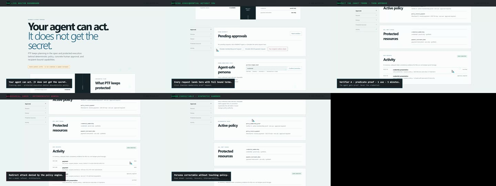

# Personal Trust Fabric

Personal Trust Fabric (PTF) lets an agent request useful actions without receiving the protected credential, payment instrument, or other reusable secret. A deterministic core binds policy, minimal disclosure, concrete Human approval, recipient authentication, one-use execution, and safe receipts.

This repository currently contains a dependency-free Node 22 synthetic sandbox for the WebMCP milestone. It is **not** a production custody system: no real credentials or payment instruments are accepted.

## Demo video (2:18)

[](https://youtu.be/Ng3RPWqJnvE)

Live hosted-dashboard tour with narration: agent-safe view, membership-proof
approval for Verifier A, $42.50 invoice payment for Merchant B, deterministic
denial of the recipient-redirect attack, policy view, and roadmap. Synthetic
sandbox — no real credentials. Submission cut:
`my-video/renders/PTF-submission-FINAL.mp4` (1080p25, 2:18).

<video src="https://github.com/Binilts03/personal-trust-fabric/releases/download/demo-v1/PTF-submission-FINAL.mp4" width="100%" controls preload="metadata"></video>

## Run locally

Requirements: Node.js 22 or newer. There are no runtime package dependencies.

```powershell
npm test
npm run dev
```

Open `http://127.0.0.1:3000`. The server binds loopback by default. The page can simulate both agent requests when WebMCP is unavailable; approval and persona correction remain separate Human-session actions.

Non-loopback binding is refused unless `PUBLIC_ORIGIN` is set to the exact HTTPS origin. For an authorized deployment environment, set `HOST`, `PORT`, and `PUBLIC_ORIGIN`; hosted session cookies are then marked `Secure`. This is configuration behavior, not authorization to deploy.

## What to try

1. Request the active-membership predicate proof for synthetic Verifier A, inspect every bound term, and approve or deny it.
2. Request the $42.50 synthetic payment for Merchant B and approve the one-use, five-minute authority.
3. Run the recipient-redirection adversarial check and observe deterministic denial.
4. Correct the agent-safe budget persona claim and observe the prior claim being superseded without changing policy.
5. Inspect the safe activity stream and its explicitly limited in-memory hash-chain evidence.

The exact judge flow and WebMCP tool prompts are in [`docs/judge-script.md`](docs/judge-script.md). The four top-level imperative tools are:

- `get_ptf_safe_view`
- `request_membership_status_proof`
- `request_synthetic_invoice_payment`
- `attempt_recipient_redirect_attack`

The adapter feature-detects `document.modelContext.registerTool`. Current ChatGPT/Chrome setup and API evidence are tracked in [`docs/research/current-sources.md`](docs/research/current-sources.md).

## Evidence and limits

- `npm test` runs core, architecture, HTTP, two-journey, leakage, Human-session, and WebMCP registration/callback checks.
- Playwright artifacts are written under `output/playwright/` during local judge-like testing.
- Synthetic recipient sessions demonstrate the recipient-authentication hook; they are not cryptographic production authentication.
- The audit chain demonstrates consistency relative to this process only; it is unkeyed, volatile, and not independently anchored.
- The Vercel preview uses the same process-local synthetic session store. A cold start can reset demo state; this is not durable custody or production authority storage.
- Production custody, recovery, interoperability, and deployment remain open and require production implementation evidence.

Licensed under the [Apache License 2.0](LICENSE).
